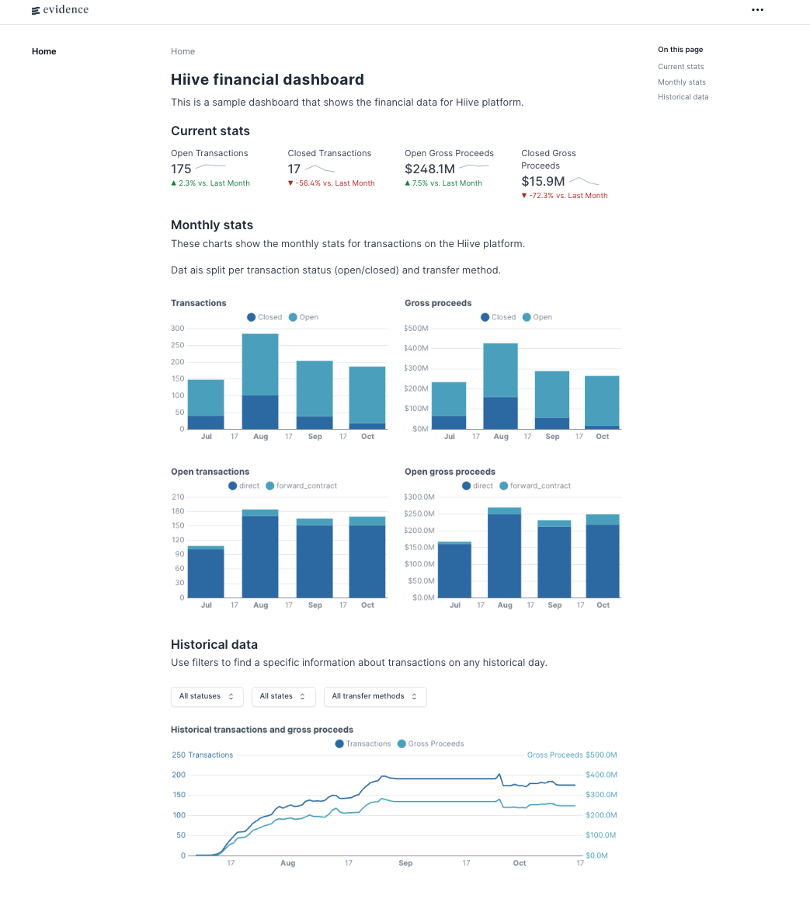

# Task 1: Model data to answer business questions about open transaction pipeline

Our Finance team would like to understand information about transactions on the Hiive platform,
specifically how much open pipeline we have at any given point in time. “Open pipeline” at Hiive
is defined as the sum of revenue associated with any transactions that are still in an “active”
state. A transaction is considered active if it is has not been cancelled, expired, closed (paid), or
declined.

Our Finance team would like to be able to answer the following questions and build the following
data visualizations:
- How much open pipeline do we have on any given historical day?
- What portion of open pipeline do we have for each specific transfer method, at a given
point in time?
- Visualize open pipeline by month broken down by transfer method.

Questions:
- Assuming this data is raw, and we have no pre-exisitng dbt models built to support this
request, what dbt sources, models, and tests would you build? Please provide code
samples (in any tool or format you choose).
- How would you ensure data quality of your models? Provide code examples.
- How can you validate that the output of your model is correct?
- How would you help the Finance team visualize this data (what chart types or methods
would you use?)

# Solution

To answer those questions I would dbt pipeline with the following steps:

1. Create staging models:
    - `stg_transactions` - raw data from transactions
    - `stg_transaction_transitions` - raw data from transaction transitions

1. Additional staging models to support downstream calculations:
    - `stg_transaction_states` - dictionary with transaction states and `is_open_tranasction` flag
    - `stg_calendar` - daily calendar table

1. Next, create marts:
    - `fct_transactions` - mostly `stg_transactions` with added `last_updated_at` column
    - `fct_transaction_transitions` - model that joins transitions, transactions, and states together
    - `fct_transaction_history` - daily state of transactions, for each status, state and transaction method; used as a final model to feed to BI tool to calculate all necessary metrics

1. (Optional) Create reporting models, that can further aggregate data for BI tool amd analysts:
    - `rpt_open_pipeline_daily` - shows daily statistics about open pipeline tranasctions and corresponding gross proceeds

Model `fct_transaction_history` will be used to answer business questions about open transaction pipeline. To visualize the data I've built a simple BI dashboard that represents most critical information about the transactions.

## Data Quality

To ensure data quality and correctnes of the output models I would add the following checks:

- **Staging** models have unique keys and have no duplicates
- Put `not_null` data tests for every column where it makes sense
- Check if all transactions have a corresponding record in transitions, and vise versa, using `relationships` test:
    - ⚠️ these checks actually return a lot of errors, so would be good to check with dev team what is going on here
- For all final **marts** we should check for duplicates. If primary key doesn't exist, we should create a composite key
- Check the **integrity** of the transitions log:
    - find transactions where first ever event was created in `closed` state (9 cases)
    - find transaction that were reopened (3 cases)
